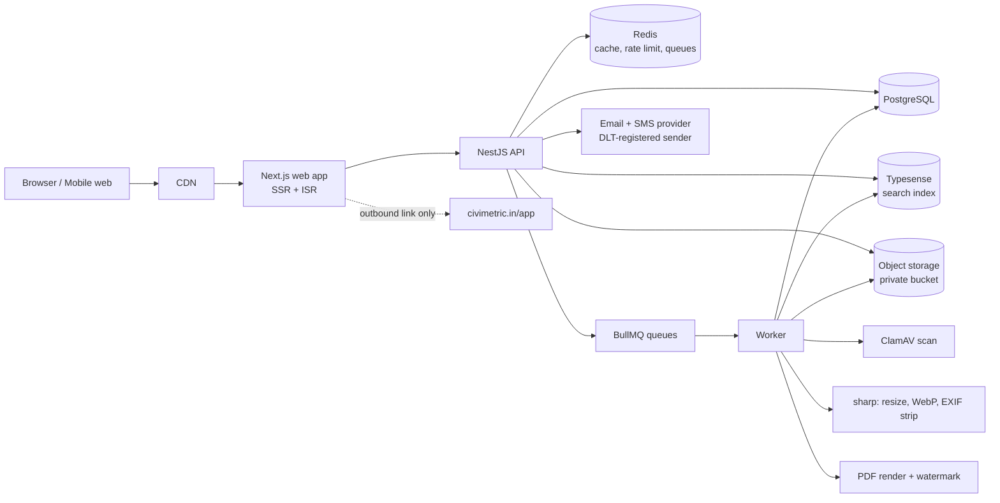
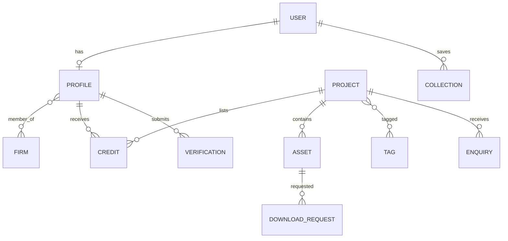
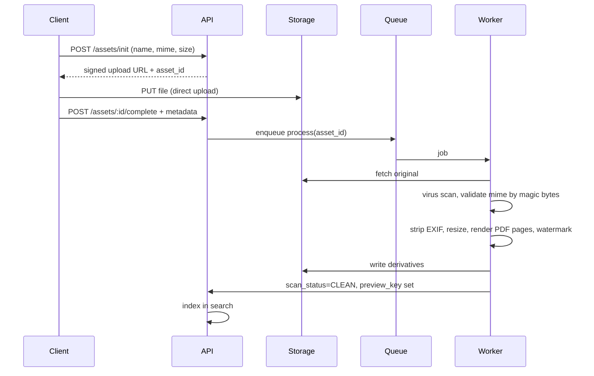

# BuiltFolio

A portfolio and discovery platform for architects, civil and structural engineers, interior designers, contractors and firms in India. Professionals upload projects, plans and designs. Clients browse, verify credits and send enquiries. Cost estimation is provided by a single outbound link to [Civimetric](https://civimetric.in).

> Working name. Replace freely. Status: pre-MVP. Target launch city: Pune / Mumbai (confirm).

---

## 1. Product Summary

| Item | Decision |
|---|---|
| Audience | Professionals (supply), clients and recruiters (demand) |
| Core objects | Profile, Firm, Project, Asset (plans/designs), Credit, Enquiry |
| Differentiator | Multi-credit projects (architect + structural + contractor on one page), verified registration, drawings with access control |
| External dependency | **Civimetric Estimator only**, via deep link. No API, no data sharing |
| Not in scope | Floor plan generation, BOQ tools, structural design or sign-off, payments (Phase 3) |
| Units | mm, m, Sqft, Sqm, Cum, MT. Area unit stored as entered, never auto-converted |
| Currency | ₹ with Indian grouping, e.g. `₹1,25,000.00` |

### Roles

| Role | Can do |
|---|---|
| Visitor | Browse, search, save (login), send enquiry (OTP) |
| Professional | Profile, projects, uploads, credits, enquiries, analytics |
| Firm Admin | Firm page, team, shared projects |
| Moderator / Admin | Review queue, verification, takedowns, featured content |

---

## 2. Architecture



### Layers

| Layer | Tech | Notes |
|---|---|---|
| Web | Next.js (App Router), TypeScript, Tailwind | SSR/ISR for SEO. Mobile-first. PWA-ready |
| API | NestJS, REST + OpenAPI | Modules: auth, profiles, firms, projects, assets, search, enquiries, verification, admin |
| DB | PostgreSQL + Prisma | Migrations in `packages/db` |
| Cache / queue | Redis, BullMQ | Rate limits, upload jobs, email jobs |
| Search | Typesense (or Meilisearch) | Typo-tolerant, faceted filters |
| Storage | S3-compatible (MinIO locally) | Private bucket, signed short-lived URLs, CDN for public derivatives only |
| Workers | Node worker app | Scan, resize, render, watermark, index |
| Auth | Email + mobile OTP, Google | JWT access + refresh, RBAC guards |
| Infra | Docker, GitHub Actions, AWS ap-south-1 | Staging + prod. Sentry. Daily DB backups, 30-day retention |

### Repository layout

```
builtfolio/
├─ apps/
│  ├─ web/            # Next.js
│  ├─ api/            # NestJS
│  └─ worker/         # BullMQ processors
├─ packages/
│  ├─ db/             # Prisma schema, migrations, seed
│  ├─ ui/             # Shared React components + tokens
│  ├─ config/         # eslint, tsconfig, tailwind preset
│  └─ shared/         # types, zod schemas, formatters (₹, Sqft)
├─ infra/             # docker-compose, terraform (later)
├─ docs/              # ADRs, wireframes
└─ README.md
```

---

## 3. Data Model



| Entity | Key fields |
|---|---|
| `User` | id, name, email, mobile, role, status, created_at |
| `Profile` | user_id, handle, discipline, city, state, bio, experience_yrs, reg_body, reg_no, verified_at |
| `Firm` | id, name, handle, city, logo_url, website, gstin (optional), verified_at |
| `Project` | id, slug, title, type, city, state, year, area_value, area_unit (`SQFT`/`SQM`), cost_band_inr, status (`DRAFT`/`REVIEW`/`PUBLIC`/`HIDDEN`), description, owner_profile_id |
| `Credit` | project_id, profile_id, role (Architect, Structural, MEP, Interior, Contractor, QS), scope_note, confirmed_at, disputed |
| `Asset` | id, project_id, kind (`IMAGE`/`DRAWING`/`MODEL`/`DOC`), drawing_type, sheet_no, scale, revision, units, access_level, file_key, preview_key, size_mb, mime, scan_status, uploaded_by |
| `DownloadRequest` | id, asset_id, requester_contact, message, status (`PENDING`/`APPROVED`/`DENIED`), decided_at |
| `Enquiry` | id, project_id, to_profile_id, from_contact, message, status |
| `Verification` | profile_id, doc_type, doc_key, status, reviewed_by, reviewed_at |
| `Tag`, `Collection` | standard |

Rules:

- Slugs are unique: `/projects/g2-residential-nagpur`.
- A project goes public only after the owner confirms the ownership declaration and (for a profile's first project) a moderator approves.
- Each credit must be confirmed by the credited person, or it shows as "unconfirmed".

---

## 4. Uploads: Plans, Drawings, Designs (BuiltFolio-owned)

### Supported files

| Type | Max size | Processing | Display |
|---|---|---|---|
| JPG, PNG, WebP | 15 MB | Scan, strip EXIF/GPS, WebP at 3 sizes | Gallery |
| PDF (drawings, specs) | 50 MB | Scan, page thumbnails, watermarked preview render | In-page viewer, zoom |
| DXF | 50 MB | Convert to SVG preview (Phase 2) | Viewer, original on request |
| DWG | 100 MB | Stored as is; preview needs licensed converter (Phase 2) | Download on request only |
| IFC, glTF/GLB | 150 MB | 3D viewer (Phase 3) | Embedded viewer |

### Pipeline



### Access levels

| Level | Visitor sees | Default for |
|---|---|---|
| `PUBLIC` | Full preview, no watermark | Images, renders |
| `WATERMARKED` | Watermarked preview, no download | PDF drawings |
| `ON_REQUEST` | Enquiry-gated. Uploader approves, then a signed link is issued (expires in 24 h) | DWG, DXF, structural |
| `PRIVATE` | Uploader and credited team only | Client-confidential |

### Rules

- Validate file type by magic bytes, not extension. Reject on failed scan.
- Strip EXIF/GPS from all images.
- Prompt before publishing: hide owner name, plot/survey number and exact address.
- Structural and MEP drawings carry the banner: **Project reference only, not for construction.** The platform gives no design sign-off or stability certification.
- Revisions are versioned (R1, R2, R3). The viewer defaults to the latest.
- Ownership declaration is mandatory. Takedown form on every project and asset.
- Originals never served from the public CDN. Signed URLs only, 10 min for previews, 24 h for approved downloads.

---

## 5. Civimetric Link (only integration)

Civimetric is used for cost estimation only, through one outbound button on project pages (Residential, Commercial, Industrial types).

| Item | Behaviour |
|---|---|
| Button | "Estimate this project on Civimetric" |
| Action | Build one-line text, copy to clipboard, open `https://www.civimetric.in/app?utm_source=builtfolio&utm_medium=referral&utm_campaign=project_page` in a new tab, show toast |
| Data sent | Nothing. The user pastes the text themselves |
| Disclosure | "Powered by Civimetric. Indicative, not a quotation." beside the button |
| Link attributes | `target="_blank" rel="noopener"` |

```ts
// packages/shared/civimetric.ts
export function civimetricText(p: {
  typeLabel: string; area: number; areaUnit: 'SQFT' | 'SQM'; city: string;
}) {
  const unit = p.areaUnit === 'SQFT' ? 'sqft' : 'sqm'; // no conversion
  return `${p.typeLabel} ${Math.round(p.area)} ${unit}, ${p.city}`;
}
// "3BHK house 1100 sqft, Nagpur"
```

Open items before launch:

- Ask Civimetric whether a URL prefill parameter exists. If yes, drop the clipboard step.
- Get written permission to use the Civimetric name and logo.
- Log `civimetric_estimate_click` with `project_id`, `project_type`, `city`.

---

## 6. Sitemap and Routes

| Page | Route | Purpose | Local Prototype File |
|---|---|---|---|
| Home | `/` | Search, featured work, categories | `Main.dc.html` (auto-routed via `index.html`) |
| Explore | `/projects` | Filters: type, city, area, cost band, year, role | `Explore.dc.html` |
| Showcase | `/projects/courtyard-house-pune` | Flagship showcase: Ar. Ritu Desai, multi-credit, interactive CAD | `Courtyard-House.dc.html` |
| Project | `/projects/[slug]` | Gallery, drawings, credits, enquiry, Civimetric estimate link | `Project.dc.html` |
| People | `/people` | Directory by discipline and city | `People.dc.html` |
| Profile | `/p/[handle]` | Bio, projects, badge, contact (Ar. Ritu Desai) | `Profile.dc.html` |
| Dashboard | `/dashboard` | Projects, uploads, enquiries, verification, analytics | `Dashboard.dc.html` |
| Firms | `/firms`, `/f/[handle]` | Firm page, team, projects | Planned (Phase 2) |
| Collections | `/collections` | Saved boards | Planned (Phase 2) |
| Journal | `/journal` | Case studies | Planned (Phase 2) |
| Static | `/about /contact /privacy /terms /takedown` | Trust and legal | Included in page footers |
| Admin | `/admin` | Moderation, verification, reports | Planned (Phase 1) |

### Interactive Prototype Architecture

The local prototype runs stand-alone in any modern browser without heavy build steps:
- **`support.js`**: Lightweight reactive runtime providing `DCLogic`, `<sc-if>`, `<sc-for>`, attribute & style interpolation, pan/zoom, measurement tools, 3D orbit projections, Civimetric clipboard formatting, and OTP verification modals.
- **`mock-data.js`**: Standardized mock dataset modeling projects, multi-disciplinary credits, drawing assets, access tiers, and Civimetric calculation parameters.
- **`canvas.json`**: Multi-board design canvas definition rendering all 7 views in a unified workspace.

---

## 7. Design System

### Tokens

```css
:root {
  --bg: #F6F5F1;        /* concrete */
  --card: #FFFFFF;
  --ink: #1C2430;
  --mute: #5D6877;
  --line: #D9D6CC;
  --blue: #1F4E8C;      /* blueprint, primary */
  --blue-soft: #E8EEF6;
  --orange: #E8671B;    /* safety, CTA */
  --ok: #2E7D32;
  --warn: #B26A00;
  --err: #C62828;
  --radius: 10px;
  --space: 8px;         /* base unit */
}
@media (prefers-color-scheme: dark) {
  :root { --bg:#12161C; --card:#1B212A; --ink:#E7EAEE; --mute:#9AA5B4;
          --line:#2F3846; --blue:#6AA3E8; --blue-soft:#1F2A3A; --orange:#F08A4B; }
}
```

### Type and layout

| Item | Spec |
|---|---|
| Headings | Geometric sans (Poppins), system fallback |
| Body | Inter or system sans, 16 px base, scale 1.25 |
| Grid | 12 columns, max width 1200 px, gutters 16 / 24 px |
| Images | 4:3 cards, lazy-loaded, blur-up placeholder |
| Contrast | WCAG AA minimum |
| Themes | Light and dark |
| Breakpoints | 480, 768, 1024, 1280 |

### Components

`SearchBar`, `FilterPanel`, `ProjectCard`, `ProfileCard`, `CreditList`, `Gallery`, `DrawingViewer`, `AccessBadge`, `UploadDropzone`, `MetadataForm`, `EnquiryForm`, `EstimateButton`, `VerifiedBadge`, `Toast`, `Modal`, `EmptyState`.

### Wireframes

**Home**

```
┌──────────────────────────────────────────────┐
│ Logo      Explore  People  Firms     [Login] │
├──────────────────────────────────────────────┤
│  Find the people who built it.               │
│  [Type ▾] [City ▾] [Role ▾]       [Search]   │
├──────────────────────────────────────────────┤
│  Featured projects                           │
│  [card] [card] [card] [card]                 │
│  Browse by type:  Residential Commercial …   │
│  Featured professionals  [avatar][avatar]…   │
│  How it works: Profile → Upload → Verify →   │
│                Get enquiries                 │
└──────────────────────────────────────────────┘
```

**Explore**

```
┌─────────────┬────────────────────────────────┐
│ Filters     │  1,248 projects     Sort ▾     │
│ Type        │  [card][card][card]            │
│ City        │  [card][card][card]            │
│ Area (Sqft) │  [card][card][card]            │
│ Cost (₹)    │            Load more           │
│ Year / Role │                                │
└─────────────┴────────────────────────────────┘
```

**Project detail**

```
┌──────────────────────────────┬───────────────┐
│ Gallery (carousel)           │ Budget a      │
│ Title, city, year, area      │ similar project│
│ Description                  │ [Estimate on  │
│ Plans & Drawings             │  Civimetric]  │
│  Floor Plan  PDF  R2 Preview │ Powered by…   │
│  Footing     PDF  R3 Request │ ───────────── │
│ Credits: Architect · Struct… │ [Enquire]     │
│ Location (city level)        │ [Save]        │
└──────────────────────────────┴───────────────┘
```

**Upload wizard (dashboard)**

```
Step 1 Details  →  Step 2 Credits  →  Step 3 Files  →  Step 4 Access  →  Step 5 Review
Files: [ Drop plans, elevations, renders, specs ]
  Floor Plan.pdf   Type[Floor plan▾] Sheet[A-01] Scale[1:100] Rev[R2] Access[Watermarked▾]
Declaration: ☐ I own this work or hold client permission
             ☐ Owner name and plot number are hidden or consented
                                              [Save draft] [Submit]
```

---

## 8. API (v1, REST)

| Method | Path | Auth | Purpose |
|---|---|---|---|
| POST | `/auth/otp/request`, `/auth/otp/verify` | Public | Mobile or email OTP login |
| GET | `/projects` | Public | List with filters, cursor paging |
| GET | `/projects/:slug` | Public | Detail, assets filtered by access level |
| POST | `/projects` | Pro | Create draft |
| PATCH | `/projects/:id` | Owner | Update, submit for review |
| POST | `/projects/:id/credits` | Owner | Add credit, notifies the person |
| POST | `/credits/:id/confirm` or `/dispute` | Credited person | Confirm or dispute |
| POST | `/assets/init` | Owner | Get signed upload URL |
| POST | `/assets/:id/complete` | Owner | Start processing |
| GET | `/assets/:id/preview` | Rule-based | Signed preview URL |
| POST | `/assets/:id/request-download` | Public (OTP) | Create download request |
| POST | `/download-requests/:id/approve` or `/deny` | Owner | Decide |
| GET | `/people`, `/p/:handle` | Public | Directory, profile |
| POST | `/enquiries` | OTP | Send enquiry |
| POST | `/verifications` | Pro | Submit registration proof |
| GET | `/admin/queue` | Admin | Moderation queue |
| POST | `/admin/projects/:id/approve` or `/reject` | Admin | Decision |
| POST | `/takedown` | Public | Report content |

Conventions: `snake_case` JSON, ISO dates, `X-Request-Id` header, error shape `{ code, message, details }`, rate limits per IP and per user via Redis.

### Search index (`projects`)

Fields: title, description, city, state, type, tags, roles, year, area_value, area_unit, cost_band_inr, profile_names, firm_names, verified (bool). Facets: type, city, year, role, cost_band_inr, verified.

---

## 9. Trust, Verification, Moderation

| Subject | Check |
|---|---|
| Architects | Council of Architecture registration number, checked manually against the register |
| Engineers | Degree or professional membership (e.g., IEI), or municipal structural-engineer licence where applicable |
| Firms | GSTIN / MSME / company registration (optional badge) |
| Credits | Credited person confirms or disputes. Disputes go to the moderation queue |
| First project per profile | Moderator review before public |
| Reports | Takedown form, 48 h target to act |

---

## 10. Security and Privacy

- DPDP Act 2023: explicit consent at signup and upload, purpose limitation, deletion on request, grievance contact on `/privacy`.
- Contact details are never shown publicly. Enquiries are relayed.
- OTP rate limits, device throttling, CAPTCHA after repeated failures.
- Private bucket, signed URLs, no public originals.
- Input validation with zod on every endpoint. Output escaping. CSP, HSTS, secure cookies.
- Audit log for admin actions and download approvals.
- Backups: daily, 30 days. Restore drill once per quarter.

---

## 11. Non-Functional Targets

| Metric | Target |
|---|---|
| LCP (4G, mid-range phone) | under 2.5 s |
| API p95 (read) | under 300 ms |
| Upload to preview ready | under 60 s for a 20 MB PDF |
| Availability | 99.5% (MVP) |
| SEO | SSR, schema.org markup, sitemap.xml, clean slugs |
| Accessibility | WCAG AA |

---

## 12. Local Setup

### Option A: Standalone Interactive Prototype (Quick Start)

The portfolio interactive prototype is fully operational with zero backend dependencies:

```bash
# Serve static directory locally
npx -y serve . --listen 3000
```

Open [http://localhost:3000](http://localhost:3000) in your browser:
- **`index.html`** automatically redirects to `Main.dc.html`.
- **`Courtyard-House.dc.html`**: Flagship showcase project with live 2D floor plan, structural column grid, interactive 3D pavilion orbit, multi-credit badges, and Civimetric clipboard estimator.
- **`Project.dc.html`**: G+2 Residential Building CAD viewer.
- **`Explore.dc.html`**: Interactive filters by category, budget, and city.
- **`Profile.dc.html` & `People.dc.html`**: Architect portfolio and verified directory.
- **`Dashboard.dc.html`**: Professional lead and project management interface.

### Option B: Full-Stack Production App

Requirements: Node 20+, pnpm 9+, Docker.

```bash
git clone <repo> builtfolio && cd builtfolio
pnpm install
cp .env.example .env
docker compose -f infra/docker-compose.yml up -d   # postgres, redis, typesense, minio, clamav
pnpm --filter @bf/db prisma migrate dev
pnpm --filter @bf/db seed
pnpm dev                                           # web :3000, api :4000, worker
```

### Environment variables

| Variable | Purpose |
|---|---|
| `DATABASE_URL` | PostgreSQL connection |
| `REDIS_URL` | Redis connection |
| `TYPESENSE_HOST`, `TYPESENSE_API_KEY` | Search |
| `S3_ENDPOINT`, `S3_BUCKET`, `S3_ACCESS_KEY`, `S3_SECRET_KEY`, `S3_REGION` | Storage |
| `CLAMAV_HOST` | Virus scan |
| `JWT_SECRET`, `JWT_REFRESH_SECRET` | Auth |
| `SMS_PROVIDER_KEY`, `SMS_SENDER_ID`, `SMS_DLT_TEMPLATE_ID` | OTP SMS (India DLT) |
| `EMAIL_API_KEY`, `EMAIL_FROM` | Transactional email |
| `GOOGLE_CLIENT_ID`, `GOOGLE_CLIENT_SECRET` | Google login |
| `NEXT_PUBLIC_CIVIMETRIC_URL` | `https://www.civimetric.in/app` |
| `SENTRY_DSN` | Error tracking |

---

## 13. Engineering Conventions

- TypeScript strict. ESLint + Prettier. Conventional Commits.
- Branches: `main` (prod), `develop` (staging), `feat/*`, `fix/*`. PRs need 1 review and green CI.
- Tests: unit (Vitest/Jest), API e2e (Supertest), UI e2e (Playwright). Required for: `civimetricText`, access-level guards, upload pipeline, ₹ and area formatters.
- Formatters in `packages/shared`: amounts as `₹1,25,000.00` (en-IN), rates 2 decimals, quantities 3 decimals, areas and volumes 2 decimals. Never mix units on one screen.
- Definition of done: tests pass, a11y check, mobile checked, analytics event added, docs updated.

---

## 14. Roadmap

| Phase | Weeks | Deliverables |
|---|---|---|
| 0. Discovery | 1–2 | 10 professional interviews, brand, wireframes sign-off, repo, CI, staging |
| 1. MVP | 3–10 | Auth, profile, projects, credits, uploads (images + PDF), access levels, Explore and search, project and profile pages, enquiry, admin moderation, Civimetric estimate button, SEO basics |
| 2. Growth | 11–18 | Firm pages, verification badges, collections, journal, DXF/DWG preview (licensed converter), analytics for professionals, email digests, Hindi and Marathi UI |
| 3. Monetise | 19+ | Premium profiles, featured placement, lead credits, 3D/IFC viewer, public API |

### MVP build order

1. Repo, CI, Docker stack, DB schema
2. Auth (OTP) and RBAC
3. Profile and project CRUD
4. Upload pipeline (init, complete, scan, resize, PDF render, watermark)
5. Access levels and download requests
6. Search and Explore
7. Project and profile pages (SSR)
8. Enquiry and notifications
9. Admin queue and verification
10. Civimetric button, analytics, SEO, launch checklist

---

## 15. Open Decisions

| # | Decision | Owner |
|---|---|---|
| 1 | Final product name and domain | Founder |
| 2 | Launch city | Founder |
| 3 | DWG/DXF converter licence and budget | Founder |
| 4 | Civimetric: URL prefill support and brand-use permission | Founder |
| 5 | SMS and email providers, DLT registration | Tech lead |
| 6 | Verification SLA and who reviews | Ops |
| 7 | Free vs premium limits (projects, GB per profile) | Founder |

---

## 16. Disclaimers

- Project pages are showcases. Structural and MEP drawings are reference only, not for construction.
- Estimates from Civimetric are indicative, not quotations. Civimetric is a separate service with its own terms.
- Uploaders are responsible for ownership and client consent. Takedowns follow `/takedown`.
